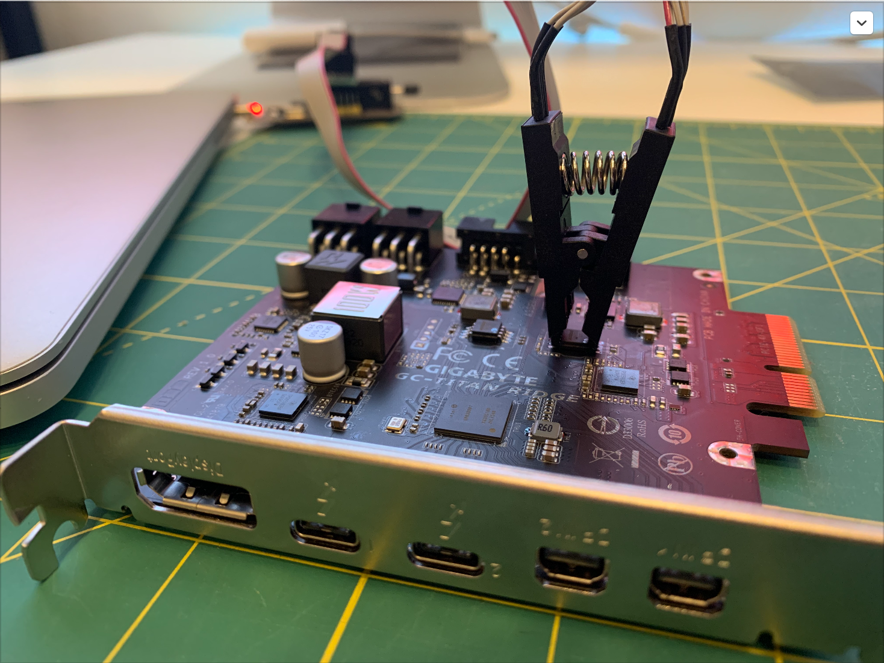
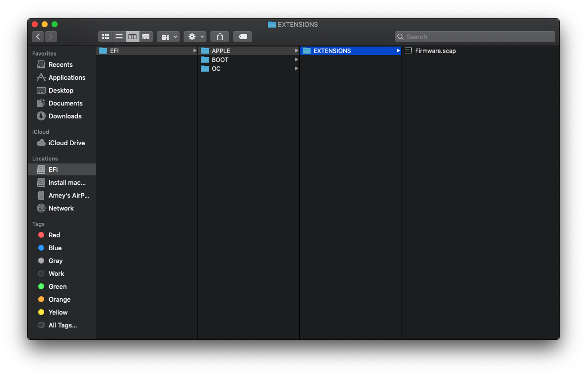

|  [Home](../README.md) ▸ Thunderbolt Mac Pro Early 2009 with Gigabyte GC-Titan Ridge Card |
|-----|


# Thunderbolt Mac Pro Early 2009 with Gigabyte GC-Titan Ridge Card

This is my story to add Thunderbolt support to my Mac Pro Early 2009 (5,1) with a Gigabyte GC-Titan Ridge Card. Before we begin a quick disclaimer below.

**Disclaimer:** Try this at your own risk. I do not guaranty that this will work for you but i hope it does. i also do not recommend anyone trying this. This is purely for educational purposes and may void your existing warranty for which I am not responsible.

## About my Mac Pro 5,1

My mac pro has the following configurations:

- Processor:        2 x 3.33 Ghz 6-Core Intel Xeon (X5680)
- Memory:           96 GB 1066 Mhz DDR3 ECC
- Graphics          Radeon RX 580 8 GB

## Prerequisites

- Obviously a Mac Pro and a Gigabyte GC-Titan Ridge Card [Amazon](https://www.amazon.com/gp/product/B07GBZL93X/ref=ppx_yo_dt_b_asin_title_o01_s00?ie=UTF8&psc=1)
- EEPROM Flash Bios USB Programmer [Amazon](https://www.amazon.com/gp/product/B07SHSL9X9/ref=ppx_yo_dt_b_asin_title_o00_s00?ie=UTF8&psc=1)
- New firmware for the Gigabyte GC-Titan Ridge Card [Link](https://forums.macrumors.com/threads/testing-tb3-aic-with-mp-5-1.2143042/post-28246620)


## My Upgrade Journey

### Install flashrom using brew

```
brew install flashrom
```


### Assembling Programmer

Look at the directions on the numbers on the green small board while assembling your programmer.


### Connect to the blue chip 

Align the programmer as shown in the image below focus on one side of the clip first. Align one side and then the other side pushing down firmly.


### Verify flashrom can detect your CH341A 24 25 Series EEPROM Flash Bios USB Programmer

```
flashrom -p ch341a_spi
```


### Backup your Blue Chip Firmware

```
flashrom -p ch341a_spi -r OriginalFirmware-BlueChip.bin
```


### Connect to green chip

Align the programmer as shown in the image below focus on one side of the clip first. Align one side and then the other side pushing down firmly.



### Backup green chip firmware

```
flashrom -p ch341a_spi -r OriginalFirmware-GreenChip.bin
```


### Flashing TitanRidgeMacOSFirmware.bin custom firmware

```
flashrom -p ch341a_spi -w TitanRidgeMacOSFirmware.bin
```


### Optional: Verify TitanRidgeMacOSFirmware.bin firmware is applied correctly

```
flashrom -p ch341a_spi -v TitanRidgeMacOSFirmware.bin
```


Alternate verify - Check against original blue chip firmware should fail:

```
flashrom -p ch341a_spi -v OriginalFirmware-BlueChip.bin
```


### Connect the card into the system

I connected this card in Slot 4 of my PCIE on Mac Pro. Also connected the display port outputs on my RX580 to the Mini Display input on the card.


### Find and mount EFI disk

```
diskutil list
mkdir /Volumes/efi
sudo mount -t msdos /dev/disk0s1 /Volumes/efi
```


### Copy Contents of MacPro5.1 OpenCore.zip file into the mounted EFI drive

I already had a EFI folder within the drive. I got an alert asking to  merge or update the contents. I chose Merge. The Final folder looked like this:

 


### Reboot one or twice into Recovery Mode

To boot into recovery mode hold down the command + R key after turning on the Mac Pro. Thunderbolt should be working after a normal boot now!!!


**Note:** I have not OpenCored my MacPro

### OS tested 

I have tested this is working on the following macOS:

- Mojave 10.14.6 
- Catalina 10.15.3 

**Note:** I do not recommend or support installing unsupported macOS on your Mac Pro.

### Known Issues

Issues that I have notices so far:
- Hot swapping devices works till at-least one device is connected to the GC-TITAN RIDGE card. 
- Brightness functionality on the thunderbolt display does not work.
- Data (USB) ports behind the Thunderbolt display do not work.

## Useful Links

- https://create.pro/titan-ridge-macos-firmware-release-download-now/?fbclid=IwAR2JecJfqwVpN3RNUsjvJce6pWDZJQQhOh-HbGptPRnJcPB-k9cgjIaIUhk
- https://linux.die.net/man/8/flashrom
- https://themacadmin.com/2012/02/15/mounting-the-efi-boot-partition-on-mac-os-x/
- https://www.macworld.co.uk/how-to/mac-software/mac-recovery-mode-3674052/
- https://forums.macrumors.com/threads/testing-tb3-aic-with-mp-5-1.2143042/page-27?post=28226897&fbclid=IwAR35B8htzngqkwVeMRcYC8FnC4dgu5NaaV777pmAdlQY-vxw-OQWLcUXydU#post-28226897
- https://forums.macrumors.com/threads/opencore-on-the-mac-pro.2207814/
